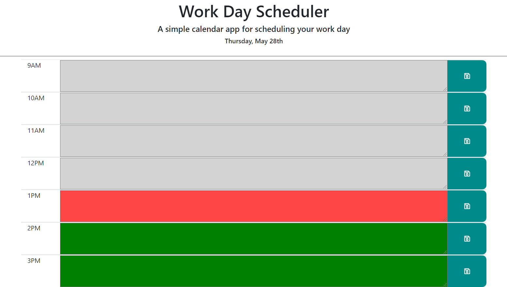

# homework5_scheduler

## [Link: Pangsua Vang Portfolio](https://pangsua26.github.io/homework5_scheduler/)

## Project Description
The purpose of this activity is to create a daily planner to manage task activities during the work day hours. The HTML will display the title with today's day (M-F) and today's date (MM/DD). The user is able to scroll up and down through the hour day periods and enter data. The hour time blocks are also color coded: light gray for past time period; red for current time period; and green for future time period. Additionally, the user should be able to save the task when refreshed.

## Sources

- Reviewed available course videos and activities
- W3 Schools 
- Bootstrap (https://getbootstrap.com/docs/4.4/layout/grid/)
- FontAwesome (https://fontawesome.com/)
- momentjs.com
- JS Switch (https://www.w3schools.com/js/js_switch.asp)
- Stack Overflow search overviews for above items

